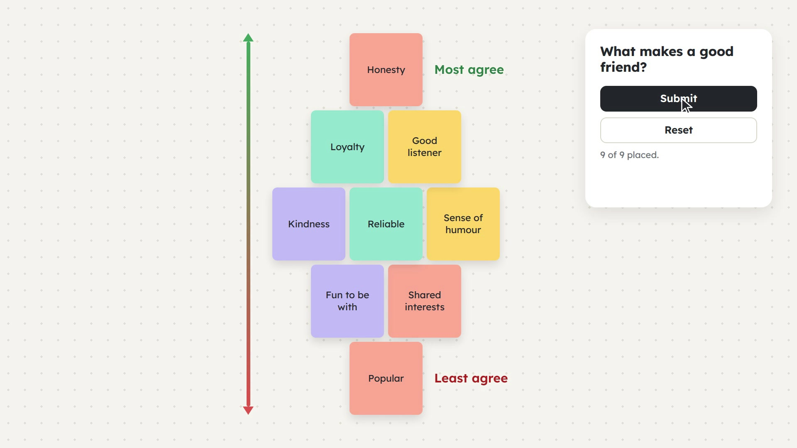

# Diamond Nine

A card sort tool for online tutoring sessions. A tutor writes nine cards and a
question; students drag the cards into a diamond (rows of 1-2-3-2-1), with the
card they agree with most at the top and least at the bottom.

[](brag.mp4)

*Click the image to watch a 22-second walkthrough.*

**Try it:** https://diamond-nine.onrender.com — create a tutor space, write
nine cards, and share the link with students.

> **This hosted copy is for testing only.** It runs on a free hosting plan, so
> saved tasks, results and dashboard links are wiped periodically. Don't rely
> on it for real sessions. It also goes to sleep when idle, so the first visit
> can take about a minute to load.

## What it does

- **Student board.** Nine sticky-note cards, a diamond of nine slots, drag and
  drop (or click/tap/keyboard to pick up and place). Submit sends the final
  arrangement to the tutor.
- **Tutor dashboard.** Create and edit tasks, copy a shareable link for each
  one, and view the arrangements students submitted.
- **Live session.** Everyone sorts the same board together, live. Students
  join from a link or QR code; the host can reset the board or submit and end
  the session.
- **No logins.** A tutor's private dashboard link is their login, with no
  password. Students never have an account; an optional display name is the
  only identity.

Built for laptops, desktops and larger tablets. Narrow screens get a message
asking for a bigger one rather than a squeezed layout.

## Running it locally

Requires Node 22 or newer.

```bash
npm install
npm start
```

Open http://localhost:3000 for the tutor dashboard. Data is stored in a SQLite
file, `diamond9.db`, next to `server.js` (set `DIAMOND9_DB` to put it
elsewhere, `PORT` to change the port).

When deploying behind a proxy (Render, for example), set `TRUST_PROXY_HOPS` to
the number of proxies in front of the app so the per-visitor rate limits see
real visitor addresses. The server logs the number to use on the first request
that arrives through a proxy after each start.

Live sessions need a second process, the realtime Worker:

```bash
npx wrangler dev
```

That serves the live rooms on `127.0.0.1:8787`, which `public/live.js` uses
automatically when the page is opened on localhost.

## How it fits together

| Part | Where | What it is |
|---|---|---|
| Frontend | `public/` | Vanilla HTML/CSS/JS, no build step |
| API | `server.js` | Express + better-sqlite3: tutors, tasks, results, QR codes |
| Live rooms | `worker/index.js` | Cloudflare Worker + Durable Objects, one room per live session |

The API and the Worker are deployed separately. The Worker is deployed with
`npx wrangler deploy --var API_BASE=<url of the deployed API>`, and
`public/live.js` holds the deployed Worker's hostname.

## Tests

With both `npm start` and `npx wrangler dev` running:

```bash
npm run test:concurrency
```

This drives several simulated students against a real live room at once and
checks the saved result.

## Design notes

`spec.md` records the decisions behind the app, including the full design of
live collaborative mode and what was deliberately left out.
